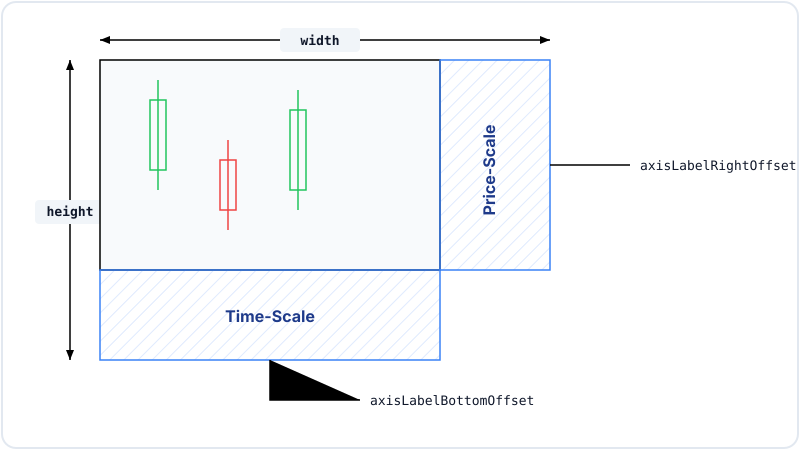
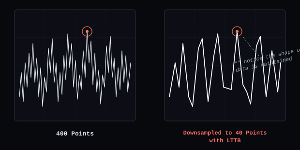

# MarketLens

[](https://www.typescriptlang.org/)
[](https://react.dev/)
[](https://vitejs.dev/)
[](https://vitest.dev/)
[](LICENSE)

A high-performance financial analytics and visualization platform for interactive market data, technical analysis, portfolio intelligence, and custom chart rendering.


*MarketLens 4-pane synchronized technical analysis studio featuring Candlestick OHLC, Volume, RSI oscillator, and MACD indicators with unified crosshairs.*

---

## Charts Available

- [Vertical Bar Chart](#vertical-bar-chart)
- [Horizontal Bar Chart](#horizontal-bar-chart)
- [Candlestick Chart](#candlestick-chart)
- [Line Chart](#line-chart)
- [Volume Chart](#volume-chart)
- [RSI Chart](#rsi-chart)
- [MACD Chart](#macd-chart)
- [Technical Analysis](#technical-analysis)
- [Market Heatmap](#market-heatmap)
- [Calendar Heatmap](#calendar-heatmap)
- [Portfolio Analytics](#portfolio-analytics)
- [Watchlist](#watchlist)
- [Dashboard](#dashboard)
- [News & Events](#news--events)
- [Performance Benchmark Studio](#performance-benchmark-studio)


---

## Utils Available

- [ChartScales](#chartscales)
- [ChartViewport](#chartviewport)
- [downsampleLTTB](#downsamplelttb)
- [Data Normalization](#data-normalization)

---

## Installation

### Prerequisites
- **Node.js**: `>= 18.0.0`
- **npm**: `>= 9.0.0`
- **Browser**: Modern web browser with HTML5 Canvas 2D support (Chrome 90+, Firefox 88+, Safari 14+, Edge 90+).

### Clone the Repository
```bash
git clone https://github.com/AnkitaPriyadarshini-repos/MarketLens.git
cd MarketLens
```

### Install Dependencies
```bash
npm install
```

### Run Development Server
```bash
npm run dev
```

### Verification & Testing
```bash
npm run typecheck   # Run TypeScript static type check
npm test            # Run Vitest unit & benchmark test suite (28 tests)
npm run benchmark   # Run deterministic performance benchmarks
npm run build       # Compile production Vite bundle
```

---

## Compatibility

| Environment | Requirement | Status |
|:---|:---|:---|
| **Platform** | Web Browsers (Chrome, Firefox, Safari, Edge) | Supported |
| **Runtime** | Node.js `>= 18.0.0`, npm `>= 9.0.0` | Verified |
| **Language** | TypeScript `5.3+` (Strict Mode) | Verified |
| **Framework** | React `18.2` | Verified |
| **Bundler** | Vite `5.1` | Verified |
| **Display** | High-DPI (Retina) Canvas `devicePixelRatio` | Supported |

---

## Important Notes

> [!IMPORTANT]
> **Web-First React + TypeScript Platform**  
> MarketLens is built strictly for modern web browsers using React 18, TypeScript 5.3, Vite, and HTML5 Canvas 2D APIs. It is not a React Native library.

> [!NOTE]
> **Simulated Demo Data Architecture**  
> MarketLens currently operates on deterministic synthetic data generators and embedded market datasets for development and benchmarking. To connect external live feeds (e.g. Polygon.io, Alpha Vantage), pass raw payloads through `normalizeMarketData()`.

> [!TIP]
> **Dual Visualization Architecture**  
> Flagship technical charts (Technical Analysis Studio, Asset Detail) use custom HTML5 Canvas primitives (`CandlestickPrimitive`, `VolumePrimitive`, `RsiPrimitive`, `MacdPrimitive`) for maximum frame performance, while overview charts use SVG.

---

## A Note on Bad Data

Market data API feeds frequently contain missing values, nulls, inverted high/low prices, or out-of-order timestamps. MarketLens enforces strict defensive normalization in `src/data/normalizer.ts` via `normalizeMarketData(rawData)` before data enters the chart scale pipeline:

- **Missing / Null Prices**: Substituted with nearest valid numeric scalar or preceding bar's `close`.
- **`NaN` / `Infinity`**: Clamped to `0` or fallback previous price to keep Canvas math finite.
- **Inverted High/Low**: Forced to $H = \max(O, C, H)$ and $L = \min(O, C, L)$ to preserve wick geometry.
- **Negative Volume**: Defaulted to `0` to prevent negative bar height calculation errors.
- **Duplicate Timestamps**: Incrementally offset by +1ms to maintain strictly monotonic x-scale steps.
- **Empty Datasets**: Renderers display a clean "No Data Available" state without throwing errors.
- **Single-Point Data**: `ChartScales` applies synthetic $\pm 5\%$ price bounds padding to prevent $0$ height collapse.

---

## Vertical Bar Chart

Tap-interactive vertical bar charts with rounded top corners, custom color tokens, and floating active value pill badge.

### Features
- Tap and hover interaction highlighting active bar in vibrant orange (`#ff7e5f`).
- Floating value pill badge (`275`) displaying exact value directly above active bar.
- Rounded top bar geometry with configurable radius.
- Left-aligned Y-axis tick labels (`0`, `137`, `273`, `410`).
- HTML5 Canvas 2D rendering pipeline with `devicePixelRatio` scaling.

### Quick Start
```jsx
import { BarChartPrimitive } from './charts/primitives/BarChartPrimitive';

const data = [
  { name: "Mon", value: 120 },
  { name: "Tue", value: 180 },
  { name: "Wed", value: 134 },
  { name: "Thu", value: 410 },
  { name: "Fri", value: 275 },
  { name: "Sun", value: 380 }
];

<BarChartPrimitive
  data={data}
  height={320}
  color="#9672f8"
  activeColor="#ff7e5f"
  dataKey="value"
  nameKey="name"
/>
```

### API Reference

| Prop | Type | Default | Description |
|:---|:---|:---|:---|
| `data` | `BarDataItem[]` | `[]` | Data point array containing categories and numeric values |
| `height` | `number` | `300` | Canvas element height in pixels |
| `color` | `string` | `"#9672f8"` | Default bar color |
| `activeColor` | `string` | `"#ff7e5f"` | Active highlighted bar and pill badge stroke color |
| `horizontal` | `boolean` | `false` | Sets layout mode (`false` for vertical, `true` for horizontal) |

---

## Horizontal Bar Chart

Tap-interactive horizontal bar charts with top X-axis tick headers, category label styling, and rounded right bar ends.

### Features
- Horizontal bar layout with rounded right bar ends.
- Top X-axis tick header (`0`, `30`, `61`, `91`) with vertical guide lines.
- Left-aligned category names (`Python`, `JavaScript`, `TypeScript`, etc.) with bold active selection state.
- Configurable dark or light background container (`#f8fafc` or `#0d0e15`).

### Quick Start
```jsx
import { BarChartPrimitive } from './charts/primitives/BarChartPrimitive';

const langData = [
  { name: "Python", value: 91 },
  { name: "JavaScript", value: 82 },
  { name: "TypeScript", value: 72 },
  { name: "Rust", value: 52 },
  { name: "Go", value: 58 },
  { name: "Swift", value: 42 },
  { name: "Kotlin", value: 46 }
];

<BarChartPrimitive
  data={langData}
  height={340}
  horizontal={true}
  color="#f59e0b"
  bgColor="#f8fafc"
/>
```

### API Reference

| Prop | Type | Default | Description |
|:---|:---|:---|:---|
| `data` | `BarDataItem[]` | `[]` | Data array containing category names and values |
| `height` | `number` | `300` | Chart container height in pixels |
| `horizontal` | `boolean` | `true` | Enables horizontal layout mode |
| `color` | `string` | `"#f59e0b"` | Horizontal bar stroke/fill color |
| `bgColor` | `string` | `"#0d0e15"` | Container background color (`"#f8fafc"` for light mode) |

---

## Candlestick Chart

Interactive HTML5 Canvas primitive rendering OHLC candlestick bars, wicks, price grid lines, and overlay indicators.

### Features
- High-frequency HTML5 Canvas 2D rendering pipeline.
- Automatic `devicePixelRatio` scale reset pass preventing blurriness on Retina displays.
- Simple Moving Average (SMA 20) overlay line.
- Exponential Moving Average (EMA 12) overlay line.
- Bollinger Bands upper and lower envelope overlays.
- Interactive crosshair cursor with real-time price badge on Y-axis.


### Quick Start
```jsx
import { CandlestickChart } from './charts/CandlestickChart';

<CandlestickChart
  data={ohlcPoints}
  height={380}
  showSma={true}
  showBollinger={true}
  zoomLevel={1.5}
  panOffset={10}
  onHoverPoint={(point, index) => console.log('Active point:', point, index)}
/>
```

### API Reference

| Prop | Type | Default | Description |
|:---|:---|:---|:---|
| `data` | `OHLCPoint[]` | `[]` | Array of normalized OHLC data points |
| `height` | `number` | `380` | Canvas element height in pixels |
| `showVolume` | `boolean` | `true` | Toggles integrated volume histogram overlay |
| `showSma` | `boolean` | `true` | Toggles Simple Moving Average (SMA 20) overlay line |
| `showEma` | `boolean` | `false` | Toggles Exponential Moving Average (EMA 12) overlay line |
| `showBollinger` | `boolean` | `false` | Toggles Bollinger Bands upper/lower envelope lines |
| `zoomLevel` | `number` | `1.0` | Active zoom scale factor (1.0x to 20.0x) |
| `panOffset` | `number` | `0` | Starting index offset for viewport pan |
| `onHoverPoint` | `function` | `null` | Callback returning `(point: OHLCPoint \| null, index: number \| null)` |
| `externalHoverIndex` | `number \| null` | `null` | Synchronized cursor index from parent pane |

### HoverCallbackInfo Payload

| Field | Type | Description |
|:---|:---|:---|
| `date` | `string` | Human-readable bar date string |
| `open` | `number` | Bar opening price |
| `high` | `number` | Period high price |
| `low` | `number` | Period low price |
| `close` | `number` | Bar closing price |
| `volume` | `number` | Trading volume |

---

## Line Chart

Smooth price trend visualization component with gradient area fills and active target ripple ring.

### Features
- Smooth cubic bezier curve rendering with gradient area fill underneath.
- Dynamic min/max Y-axis auto-scaling.
- Active hover target ripple ring with floating price callout badge.

### Quick Start
```jsx
import { LineChartPrimitive } from './charts/primitives/LineChartPrimitive';

<LineChartPrimitive
  data={priceSeries}
  height={350}
  showArea={true}
  color="#ff7e5f"
  interactive={true}
/>
```

### API Reference

| Prop | Type | Default | Description |
|:---|:---|:---|:---|
| `data` | `OHLCPoint[]` | `[]` | Normalized data array containing price records |
| `height` | `number` | `350` | Chart container height in pixels |
| `showArea` | `boolean` | `true` | Toggles translucent gradient area fill |
| `color` | `string` | `"#ff7e5f"` | Primary trend line stroke color |
| `interactive` | `boolean` | `true` | Enables active hover target ripple ring |

---

## Pie & Donut Chart

Tap-interactive pie and donut chart primitive with popped-out slice highlight and floating label pill badge.

### Features
- Donut and pie mode via `isDonut` prop.
- Tap/hover slice highlight popping out segment slightly with color brightness filter.
- Floating dark label pill badge (`Social 38 (38.0%)`) showing active category, value, and percentage.
- HTML5 Canvas 2D rendering pipeline with `devicePixelRatio` scaling.

### Quick Start
```jsx
import { PieDonutPrimitive } from './charts/primitives/PieDonutPrimitive';

const data = [
  { name: "Sales", value: 40, color: "#FF6B6B" },
  { name: "Support", value: 25, color: "#4ECDC4" },
  { name: "Marketing", value: 20, color: "#45B7D1" },
  { name: "Ops", value: 15, color: "#FFA07A" }
];

<PieDonutPrimitive
  data={data}
  height={300}
  isDonut={true}
  dataKey="value"
  nameKey="name"
/>
```

### API Reference

| Prop | Type | Default | Description |
|:---|:---|:---|:---|
| `data` | `PieDataItem[]` | `[]` | Array of slice items containing names, values, and hex colors |
| `height` | `number` | `300` | Chart container height in pixels |
| `isDonut` | `boolean` | `true` | Toggles donut mode with inner radius hole |
| `dataKey` | `string` | `'value'` | Object key for numeric slice value |
| `nameKey` | `string` | `'name'` | Object key for category label name |

---

## Volume Chart

Synchronized Canvas volume histogram primitive displaying trading volume bars aligned on the x-axis timeline.

### Features
- Bullish/bearish color coding (Green for close $\ge$ open, Red for close $<$ open).
- Max volume scaling relative to current viewport slice.
- Synchronized crosshairs tracking parent candlestick pane.


### Quick Start
```jsx
import { VolumeChart } from './charts/VolumeChart';

<VolumeChart data={ohlcPoints} height={80} hoverIndex={activeHoverIdx} />
```

### API Reference

| Prop | Type | Default | Description |
|:---|:---|:---|:---|
| `data` | `OHLCPoint[]` | `[]` | Data point array containing volume numbers |
| `height` | `number` | `80` | Canvas volume pane height in pixels |
| `hoverIndex` | `number \| null` | `null` | Synchronized cursor index from parent pane |
| `onHoverIndex` | `function` | `null` | Hover callback returning active data index |

---

## RSI Chart

Canvas primitive rendering the Relative Strength Index (RSI 14-period) oscillator pane with overbought and oversold thresholds.

### Features
- Continuous RSI oscillator line rendering.
- Overbought (70) and oversold (30) threshold guidelines.
- Dynamic color highlighting when RSI enters overbought or oversold zones.


### Quick Start
```jsx
import { RSIChart } from './charts/RSIChart';

<RSIChart data={ohlcPoints} height={90} hoverIndex={activeHoverIdx} />
```

### API Reference

| Prop | Type | Default | Description |
|:---|:---|:---|:---|
| `data` | `OHLCPoint[]` | `[]` | Data array containing `rsi` indicator values |
| `height` | `number` | `90` | Canvas pane height in pixels |
| `hoverIndex` | `number \| null` | `null` | Synchronized cursor index from parent pane |
| `onHoverIndex` | `function` | `null` | Hover callback returning active index |

---

## MACD Chart

Canvas primitive rendering Moving Average Convergence Divergence (MACD) signal line, MACD line, and center histogram.

### Features
- MACD Line, Signal Line, and histogram bars centered around $0.0$ line.
- Color-coded histogram bars (Green above signal, Red below signal).
- Aligned crosshair cursor with parent price pane.


### Quick Start
```jsx
import { MACDChart } from './charts/MACDChart';

<MACDChart data={ohlcPoints} height={90} hoverIndex={activeHoverIdx} />
```

### API Reference

| Prop | Type | Default | Description |
|:---|:---|:---|:---|
| `data` | `OHLCPoint[]` | `[]` | Data array containing `macdLine`, `macdSignal`, and `macdHist` |
| `height` | `number` | `90` | Canvas pane height in pixels |
| `hoverIndex` | `number \| null` | `null` | Synchronized cursor index from parent pane |
| `onHoverIndex` | `function` | `null` | Hover callback returning active index |

---

## Technical Analysis

Flagship 4-pane synchronized technical terminal coordinating price, volume, RSI, and MACD indicators under a unified interaction model.

### Features
- **Shared Timeline Alignment**: X-axis step synchronization across all 4 stacked chart panes.
- **Unified Crosshairs**: Pointer movement highlights exact date, price, volume, RSI, and MACD metrics simultaneously across all panes.
- **Focal-Point Zoom & Pan**: Mouse wheel zooming centered at cursor index with safety clamping.
- **Timeframe Selector**: Instant switching across `15m`, `1h`, `4h`, `1D`, `1W`.
- **Keyboard Navigation**: Left <kbd>←</kbd> and Right <kbd>→</kbd> arrow key step navigation across historical bars.


### Quick Start
```jsx
import { TechnicalAnalysisScreen } from './screens/TechnicalAnalysis';

<TechnicalAnalysisScreen asset={selectedAsset} marketProvider={MarketProvider} />
```

### API Reference

| Prop | Type | Default | Description |
|:---|:---|:---|:---|
| `asset` | `object` | `null` | Active asset object containing symbol and profile metadata |
| `marketProvider` | `object` | `null` | Market data provider supplying historical OHLC series |

---

## Market Heatmap

Interactive sector performance heatmap grid displaying equities grouped by sector and sized by market capitalization.

### Features
- Treemap block layout sized proportionally by market capitalization.
- Color scale intensity reflecting 24-hour return percentage (-5% to +5%).
- Filter by sector (Technology, Healthcare, Financials, Energy, Consumer Cyclical).

### Quick Start
```jsx
import { MarketHeatmapScreen } from './screens/MarketHeatmap';

<MarketHeatmapScreen marketProvider={MarketProvider} onSelectAsset={(symbol) => console.log(symbol)} />
```

### API Reference

| Prop | Type | Default | Description |
|:---|:---|:---|:---|
| `marketProvider` | `object` | `required` | Market data provider supplying heatmap data |
| `onSelectAsset` | `function` | `undefined` | Callback fired when a ticker block is clicked |

---

## Calendar Heatmap

GitHub-style annual trading calendar heatmap displaying daily performance intensity and activity metrics across trading days.

### Features
- Year/month calendar block grid rendering.
- Tooltip popover displaying date, daily return %, and traded volume.
- Interactive year navigation controls.

### Quick Start
```jsx
import { CalendarHeatmapScreen } from './screens/CalendarHeatmap';

<CalendarHeatmapScreen />
```

### API Reference

| Prop | Type | Default | Description |
|:---|:---|:---|:---|
| `metric` | `string` | `'return'` | Active metric mode (`'return'`, `'volume'`, `'pnl'`) |
| `days` | `number` | `90` | Total calendar days to display |

---

## Portfolio Analytics

Comprehensive portfolio holdings management screen featuring asset allocation distribution charts and equity performance tracking.

### Features
- Portfolio asset allocation donut chart.
- Position table listing shares, average cost, current price, total value, and unrealized gain/loss.
- Portfolio value summary cards.

### Quick Start
```jsx
import { PortfolioScreen } from './screens/Portfolio';

<PortfolioScreen marketProvider={MarketProvider} onSelectAsset={(sym) => console.log(sym)} />
```

### API Reference

| Prop | Type | Default | Description |
|:---|:---|:---|:---|
| `marketProvider` | `object` | `required` | Market data provider supplying portfolio holdings payload |
| `onSelectAsset` | `function` | `undefined` | Callback fired when selecting a portfolio position |

---

## Watchlist

Custom asset tracking hub with price alert threshold configuration.

### Features
- Custom watchlist ticker creation and deletion.
- Target price alert trigger configuration (Alert above / Alert below).
- Mini sparkline preview charts for tracked stocks.

### Quick Start
```jsx
import { WatchlistScreen } from './screens/Watchlist';

<WatchlistScreen marketProvider={MarketProvider} onOpenAlerts={() => setOpenModal(true)} />
```

---

## Dashboard

Overview hub providing global equity index tickers, top market movers, sector momentum cards, and stock search modal.

### Features
- Marquee ticker tape displaying global indices (S&P 500, Nasdaq, Dow Jones, FTSE 100).
- Instant ticker search modal supporting keyboard shortcut (<kbd>Cmd</kbd>+<kbd>K</kbd> / <kbd>Ctrl</kbd>+<kbd>K</kbd>).
- Sector performance overview grid.

### Quick Start
```jsx
import { DashboardScreen } from './screens/Dashboard';

<DashboardScreen marketProvider={MarketProvider} onSelectAsset={(sym) => console.log(sym)} />
```

---

## News & Events

Financial news aggregator feed providing market news items, sentiment tags, and economic calendar events.

### Features
- Categorized news feed (Market News, Earnings Reports, Macroeconomics).
- Sentiment indicator tags (Bullish, Bearish, Neutral).
- Filter news items by ticker symbol.

### Quick Start
```jsx
import { NewsEventsScreen } from './screens/NewsEvents';

<NewsEventsScreen marketProvider={MarketProvider} />
```

---

## Performance Benchmark Studio

Interactive testing studio built directly into the application allowing real-time benchmarking of data normalization, viewport slicing, LTTB downsampling, and hit testing.

### Features
- Benchmark data sizes: 1,000 points, 10,000 points, 50,000 points, and 100,000 points.
- Real-time execution timing graphs and logs.
- Trigger benchmarks in-browser or via CLI (`npm run benchmark`).

### Quick Start
```jsx
import { PerformanceBenchmarkScreen } from './screens/Performance';

<PerformanceBenchmarkScreen />
```

---

## Chart Engine

MarketLens relies on a structured 8-stage visualization pipeline:

```
Data Provider
      ↓
Normalization
      ↓
 Chart Model
      ↓
   Viewport
      ↓
 Scale Mapping
      ↓
   Geometry
      ↓
Canvas Primitives
      ↓
  Interaction
      ↓
Crosshair / Tooltip
```


*Chart region layout calculation: width = containerWidth - axisLabelRightOffset, height = containerHeight - axisLabelBottomOffset.*

---

### `ChartScales`

Path: `src/charts/core/ChartScales.ts`

Provides pure mathematical coordinate transformations between price/time domains and screen pixel dimensions.

```typescript
export class ChartScale {
  readonly domainMin: number;
  readonly domainMax: number;
  readonly rangeMin: number;
  readonly rangeMax: number;

  constructor(domainMin: number, domainMax: number, rangeMin: number, rangeMax: number);
  priceToY(price: number): number;
  yToPrice(y: number): number;
  static indexToX(index: number, stepX: number, marginLeft?: number): number;
  static xToIndex(x: number, stepX: number, marginLeft?: number, totalCount?: number): number;
}

export function findNearestPointIndex(dataLength: number, mouseX: number, marginLeft?: number, chartWidth?: number): number;
export function calculateCandleGeometry(point: OHLCPoint, index: number, stepX: number, marginLeft: number, priceScale: ChartScale): CandleGeometry;
```

#### Method Specifications
- **`priceToY(price)`**: Linear scale mapping price values $[P_{\min}, P_{\max}]$ to canvas Y pixel coordinates $[0, H]$.
- **`yToPrice(y)`**: Inverse scale mapping canvas Y pixel coordinates back to price values.
- **`findNearestPointIndex(...)`**: $O(\log N)$ binary search hit testing resolving mouse X coordinates to data indices.

---

### `ChartViewport`

Path: `src/charts/core/ChartViewport.ts`

Immutable viewport window manager handling zoom levels, pan offsets, and visible range calculations.

```typescript
export class ChartViewport {
  readonly totalDataLength: number;
  readonly zoomLevel: number;
  readonly panOffset: number;

  constructor(totalDataLength?: number, zoomLevel?: number, panOffset?: number);
  getVisibleRange(): ViewportRange;
  zoomAtFocalIndex(factor: number, focalIdx?: number | null): ChartViewport;
  pan(deltaBars: number): ChartViewport;
  reset(): ChartViewport;
}
```

#### Method Specifications
- **`getVisibleRange()`**: Computes active `startIdx`, `endIdx`, and `visibleCount` for slicing arrays.
- **`zoomAtFocalIndex(factor, focalIdx)`**: Zooms relative to a specific cursor focal index while preserving mouse focal ratio.
- **`pan(deltaBars)`**: Shifts visible window by N bar offsets with safety clamping against total data length.

---

### `downsampleLTTB`

Path: `src/charts/core/Downsampler.ts`

Largest-Triangle-Three-Buckets (LTTB) downsampling algorithm designed to reduce dense financial time-series datasets (1k to 100k+ points) down to visible pixel resolutions while preserving local price extrema (peaks and valleys).

#### Signature

```typescript
export function lttbDownsample(data: OHLCPoint[], threshold: number): OHLCPoint[];
```

#### Parameter Table

| Parameter | Type | Description |
|:---|:---|:---|
| `data` | `OHLCPoint[]` | Raw array of normalized market data points |
| `threshold` | `number` | Target number of downsampled points to return |

#### Notes
- Preserves the absolute first and last data points in the series.
- Divides intermediate series into `threshold - 2` equal buckets.
- Computes effective triangle areas per bucket to retain key inflection points.
- Computational Complexity: $O(N)$ linear execution time.



---

## TypeScript Types

Authoritative type definitions live in `src/types/chart.ts`:

```typescript
export interface OHLCPoint {
  date: string;
  open: number;
  high: number;
  low: number;
  close: number;
  price: number;
  volume: number;

  // Optional Technical Indicators
  sma20?: number | null;
  sma50?: number | null;
  ema12?: number | null;
  ema26?: number | null;
  wma14?: number | null;
  vwap?: number | null;
  bollingerUpper?: number | null;
  bollingerMiddle?: number | null;
  bollingerLower?: number | null;
  rsi?: number | null;
  macdLine?: number | null;
  macdSignal?: number | null;
  macdHist?: number | null;
  stochK?: number | null;
  stochD?: number | null;
  atr?: number | null;
  obv?: number | null;
}

export interface ViewportRange {
  startIdx: number;
  endIdx: number;
  visibleCount: number;
}

export interface CandleGeometry {
  x: number;
  yHigh: number;
  yLow: number;
  yOpen: number;
  yClose: number;
  bodyY: number;
  bodyHeight: number;
  candleWidth: number;
  isBullish: boolean;
}

export interface TooltipModel {
  date: string;
  open: number;
  high: number;
  low: number;
  close: number;
  volume: number;
  change: number;
  changePercent: number;
  rsi?: number | null;
  macdLine?: number | null;
}
```

---

## Data Provider Abstraction

MarketLens separates data provider implementations from visual components using the Provider Pattern (`src/data/MarketDataProvider.js`).

### Current vs. Live Integration Architecture
- **Current Architecture**: Uses deterministic synthetic data generators (`generateSyntheticMarketData`) to deliver realistic high-density datasets (1k to 100k points) for UI testing and benchmarking.
- **Future Integration Path**: Live REST or WebSocket financial data providers (e.g. Polygon.io, Alpha Vantage) plug into `MarketDataProvider` by implementing `normalizeMarketData()`, requiring **zero modifications** to chart rendering primitives.

---

## Categorical Line vs. Sequential Time Series

| Dimension | Categorical / Index Series | Sequential Time Series |
|:---|:---|:---|
| **X-Axis Mapping** | Uniform index step (`stepX = width / count`) | Timestamp elapsed interval mapping |
| **Point Spacing** | Equal pixel spacing per bar | Gap-preserving timestamp step |
| **Best Use Case** | Intraday 1M, 5M bar charts, discrete heatmaps | Historical 1Y, 5Y daily/weekly market series |

---

## Interaction Model

| Interaction | Trigger Action | Component Behavior |
|:---|:---|:---|
| **Pointer Move** | Hover over chart pane | Resolves nearest index via $O(\log N)$ binary search, rendering synchronized crosshairs on all panes |
| **Mouse Wheel** | Scroll wheel up/down | Triggers `zoomAtFocalIndex`, zooming around cursor position |
| **Mouse Drag** | Drag left/right | Pans visible viewport range with boundary clamping |
| **Keyboard Left/Right** | Arrow keys <kbd>←</kbd> / <kbd>→</kbd> | Steps cursor back and forward bar-by-bar across historical data |
| **Pointer Leave** | Mouse exits canvas | Clears active crosshair lines and tooltips |

---

## Project Structure

```
MarketLens/
├── README.md                      # Primary developer documentation
├── LICENSE                        # MIT License
├── package.json                   # Project metadata & scripts
├── index.html                     # Vite entry HTML
├── assets/
│   └── images/                    # Visual chart screenshots
├── src/
│   ├── charts/                    # CandlestickChart, LineChart, VolumeChart, RSIChart, MACDChart, Heatmaps
│   ├── screens/                   # Dashboard, AssetDetail, TechnicalAnalysis, Portfolio, Watchlist, etc.
│   ├── data/                      # MarketDataProvider & defensive normalizer
│   ├── types/                     # TypeScript type definitions
│   ├── core/                      # ChartScales, ChartViewport, Downsampler
│   ├── components/                # UI modals, navigation header, search
│   └── App.jsx                    # Application root component
└── tests/                         # Unit tests & performance benchmark runner
```

---

## To Do

- [ ] Real-time WebSocket streaming market data provider adapter
- [ ] L2 Order Book depth volume ladder primitive
- [ ] User-scriptable custom indicator math engine
- [ ] Split-screen multi-asset chart terminal comparison
- [ ] High-resolution PNG/SVG chart image export

---

## Contributing

Contributions are welcome! Please submit Pull Requests from clean topic branches (`feature/<name>`, `fix/<name>`, `perf/<name>`). Ensure all verification checks pass before submitting:

```bash
npm run typecheck && npm test && npm run build
```

---

## License

MarketLens is open-source software licensed under the terms of the [MIT License](LICENSE).
