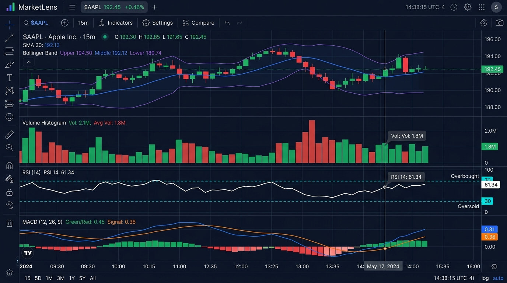
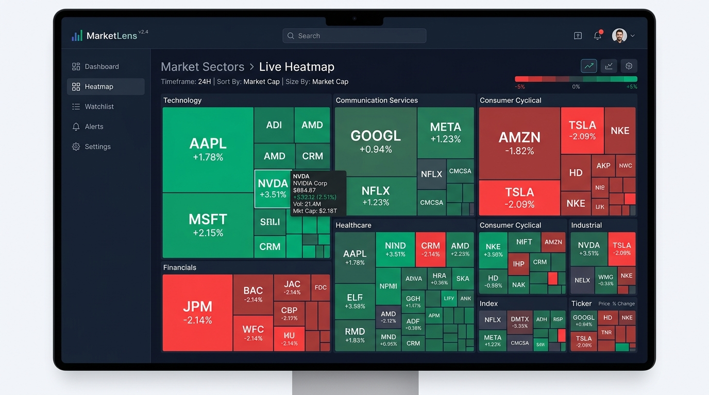
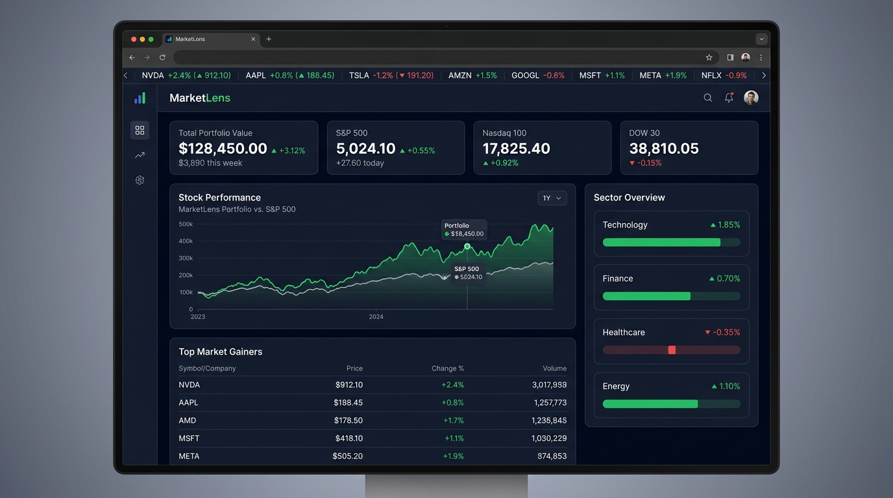

# MarketLens


A high-performance financial analytics and visualization platform built around a custom interactive chart engine.

MarketLens is a web-first financial analytics platform focused on high-density market visualization, interactive technical analysis, synchronized multi-pane charting, and resilient data processing.


*MarketLens 4-pane synchronized technical analysis studio featuring Candlestick OHLC, Volume, RSI oscillator, and MACD indicators with unified crosshairs.*

---

## Charts Available

- [Candlestick Chart](#candlestick-chart)
- [Line Chart](#line-chart)
- [Volume Chart](#volume-chart)
- [RSI Chart](#rsi-chart)
- [MACD Chart](#macd-chart)
- [Market Heatmap](#market-heatmap)
- [Calendar Heatmap](#calendar-heatmap)
- [Portfolio Analytics](#portfolio-analytics)
- [Performance Analytics](#performance-analytics)
- [Watchlist](#watchlist)
- [News & Events](#news--events)

---

## Utils Available

- [ChartScales](#chartscales)
- [ChartViewport](#chartviewport)
- [downsampleLTTB](#downsamplelttb)
- [Data Normalization](#data-normalization)

---

## Installation

### Prerequisites
- **Node.js**: `>= 18.0.0`
- **npm**: `>= 9.0.0`

### Clone the Repository
```bash
git clone https://github.com/AnkitaPriyadarshini-repos/MarketLens.git
cd MarketLens
```

### Install Dependencies
```bash
npm install
```

### Run Development Server
```bash
npm run dev
```

### Verification & Testing Commands
```bash
npm run typecheck   # Static TypeScript check
npm test            # Run Vitest test suite (28 tests)
npm run benchmark   # Run performance benchmarks
npm run build       # Production Vite build
```

---

## Compatibility

| Environment | Requirement | Status |
|:---|:---|:---|
| **Platform** | Web Browsers (Chrome, Firefox, Safari, Edge) | Supported |
| **Runtime** | Node.js `>= 18.0.0`, npm `>= 9.0.0` | Verified |
| **Language** | TypeScript `5.3+` | Verified |
| **Framework** | React `18.2` | Verified |
| **Bundler** | Vite `5.1` | Verified |
| **Display** | High-DPI (Retina) Canvas `devicePixelRatio` | Supported |

---

## Important Notes

> [!IMPORTANT]
> **Web-First React + TypeScript Platform**  
> MarketLens is built strictly for modern web browsers using React 18, TypeScript 5.3, Vite, and HTML5 Canvas 2D APIs.

> [!NOTE]
> **Simulated Demo Data Architecture**  
> MarketLens operates on deterministic synthetic data generators for visualization and benchmarking. To connect live market data feeds, pass raw payloads through `normalizeMarketData()`.

> [!TIP]
> **Dual Rendering Strategy**  
> Technical charting panes use custom HTML5 Canvas primitives (`CandlestickPrimitive`, `VolumePrimitive`, `RsiPrimitive`, `MacdPrimitive`) for frame performance, while overview charts use SVG.

---

## A Note on Bad Data

MarketLens enforces strict defensive normalization via `normalizeMarketData()` in `src/data/normalizer.ts`:

- **Null / Missing Prices**: Substituted with nearest valid scalar or prior bar close.
- **`NaN` / `Infinity`**: Clamped to `0` or fallback previous price to keep calculations finite.
- **Inverted High/Low**: Forced to $H = \max(O, C, H)$ and $L = \min(O, C, L)$ to preserve wick geometry.
- **Negative Volume**: Defaulted to `0` to prevent negative bar height calculation errors.
- **Duplicate Timestamps**: Incrementally offset by +1ms to maintain strictly monotonic x-scale steps.
- **Empty Datasets**: Renderers display a clean "No Data Available" state without throwing errors.
- **Single-Point Data**: `ChartScales` applies synthetic $\pm 5\%$ price bounds padding to prevent $0$ height collapse.

---

## Candlestick Chart

### Features
- Interactive HTML5 Canvas OHLC candlestick rendering.
- Focal-point zooming centered around cursor position (`zoomAtFocalIndex`).
- Smooth viewport pan with safety boundary clamping.
- Technical overlays (SMA 20, EMA 12, Bollinger Bands).
- High-DPI (Retina) display support via `devicePixelRatio` scaling.



### Quick Start
```jsx
import { CandlestickChart } from './charts/CandlestickChart';

<CandlestickChart
  data={ohlcPoints}
  height={380}
  showSma={true}
  showBollinger={true}
  zoomLevel={1.5}
  panOffset={10}
  onHoverPoint={(point, index) => console.log('Active bar:', point)}
/>
```

### API Reference
| Prop | Type | Default | Description |
|:---|:---|:---|:---|
| `data` | `OHLCPoint[]` | `[]` | Array of normalized OHLC data points |
| `height` | `number` | `380` | Canvas height in pixels |
| `showSma` | `boolean` | `true` | Toggles SMA 20 moving average overlay line |
| `showEma` | `boolean` | `false` | Toggles EMA 12 moving average overlay line |
| `showBollinger` | `boolean` | `false` | Toggles Bollinger Bands upper/lower envelope lines |
| `zoomLevel` | `number` | `1.0` | Active zoom scale factor (1.0x to 20.0x) |
| `panOffset` | `number` | `0` | Pan offset index for viewport slicing |
| `onHoverPoint` | `function` | `null` | Hover callback returning active point and index |

---

## Line Chart

### Features
- Smooth price history trend visualization.
- Gradient fill area below price line.
- Hover point indicator with price tooltip badge.


### Quick Start
```jsx
import { LineChartPrimitive } from './charts/primitives/LineChartPrimitive';

<LineChartPrimitive data={priceSeries} height={260} strokeColor="#10b981" />
```

### API Reference
| Prop | Type | Default | Description |
|:---|:---|:---|:---|
| `data` | `OHLCPoint[]` | `[]` | Data point array containing price values |
| `height` | `number` | `260` | Chart canvas height in pixels |
| `strokeColor` | `string` | `"#10b981"` | Primary trend line color |

---

## Volume Chart

### Features
- Canvas volume histogram synchronized with price x-axis.
- Bullish/bearish color coding (Green for close $\ge$ open, Red for close $<$ open).
- Viewport max volume scaling.


### Quick Start
```jsx
import { VolumeChart } from './charts/VolumeChart';

<VolumeChart data={ohlcPoints} height={120} externalHoverIndex={activeHoverIdx} />
```

### API Reference
| Prop | Type | Default | Description |
|:---|:---|:---|:---|
| `data` | `OHLCPoint[]` | `[]` | Data point array containing volume numbers |
| `height` | `number` | `120` | Canvas volume pane height in pixels |
| `externalHoverIndex` | `number \| null` | `null` | Synchronized cursor index from parent pane |

---

## RSI Chart

### Features
- Relative Strength Index (RSI 14-period) oscillator.
- Overbought (70) and oversold (30) threshold guidelines.
- Dynamic color highlighting when RSI enters extreme bounds.


### Quick Start
```jsx
import { RSIChart } from './charts/RSIChart';

<RSIChart data={ohlcPoints} height={120} overbought={70} oversold={30} />
```

### API Reference
| Prop | Type | Default | Description |
|:---|:---|:---|:---|
| `data` | `OHLCPoint[]` | `[]` | Data array containing `rsi` indicator values |
| `height` | `number` | `120` | Canvas pane height in pixels |
| `overbought` | `number` | `70` | Upper overbought threshold line |
| `oversold` | `number` | `30` | Lower oversold threshold line |

---

## MACD Chart

### Features
- MACD Line, Signal Line, and histogram bars around $0.0$ center axis.
- Color-coded histogram bars.
- Aligned crosshairs tracking parent price pane.


### Quick Start
```jsx
import { MACDChart } from './charts/MACDChart';

<MACDChart data={ohlcPoints} height={130} externalHoverIndex={activeHoverIdx} />
```

### API Reference
| Prop | Type | Default | Description |
|:---|:---|:---|:---|
| `data` | `OHLCPoint[]` | `[]` | Data array containing `macdLine`, `macdSignal`, and `macdHist` |
| `height` | `number` | `130` | Canvas pane height in pixels |

---

## Market Heatmap

### Features
- Treemap block layout sized by market capitalization.
- Color scale intensity based on 24-hour return %.
- Grouping by sector (Technology, Financials, Healthcare, etc.).


### Quick Start
```jsx
import { MarketHeatmap } from './charts/MarketHeatmap';

<MarketHeatmap marketProvider={MarketProvider} onSelectAsset={(sym) => setTicker(sym)} />
```

### API Reference
| Prop | Type | Default | Description |
|:---|:---|:---|:---|
| `marketProvider` | `object` | `required` | Market data provider instance |
| `onSelectAsset` | `function` | `undefined` | Callback fired when a sector block is clicked |

---

## Calendar Heatmap

### Features
- Annual trading day contribution grid.
- Daily return % and volume tooltip popover.
- Interactive year navigation controls.



### Quick Start
```jsx
import { CalendarHeatmap } from './charts/CalendarHeatmap';

<CalendarHeatmap year={2026} />
```

### API Reference
| Prop | Type | Default | Description |
|:---|:---|:---|:---|
| `year` | `number` | `2026` | Active calendar year to display |

---

## Portfolio Analytics

### Features
- Holdings tracking with asset allocation pie breakdown.
- Cost basis, current value, and unrealized gain/loss calculations.
- Portfolio equity curve visualization.


### Quick Start
```jsx
import { PortfolioScreen } from './screens/Portfolio';

<PortfolioScreen marketProvider={MarketProvider} />
```

### API Reference
| Prop | Type | Default | Description |
|:---|:---|:---|:---|
| `marketProvider` | `object` | `required` | Data provider instance supplying holdings payload |

---

## Performance Analytics

### Features
- Deterministic benchmark runner for N raw records (1k, 10k, 50k, 100k points).
- Real-time execution timing graphs.
- Latency metrics breakdown for Normalization, LTTB Downsampling, Viewport Slicing, and Hit Testing.


### Quick Start
```jsx
import { PerformanceBenchmarkScreen } from './screens/Performance';

<PerformanceBenchmarkScreen />
```

### API Reference
| Prop | Type | Default | Description |
|:---|:---|:---|:---|
| N/A | N/A | N/A | Interactive benchmark screen |

---

## Watchlist

### Features
- Saved ticker tracking list.
- Custom price alert trigger configuration.
- Quick asset detail drilldown.



### Quick Start
```jsx
import { WatchlistScreen } from './screens/Watchlist';

<WatchlistScreen marketProvider={MarketProvider} onOpenAlerts={handleOpenAlerts} />
```

---

## News & Events

### Features
- Categorized financial news stream.
- Sentiment tags (Bullish, Bearish, Neutral).
- Filter news items by ticker symbol.


### Quick Start
```jsx
import { NewsEventsScreen } from './screens/NewsEvents';

<NewsEventsScreen marketProvider={MarketProvider} />
```

---

## Chart Engine Utilities

### `ChartScales`
Path: `src/charts/core/ChartScales.ts`  
Provides pure mathematical coordinate transformations:
- `priceToY(price)`: Converts price scalar to Y canvas coordinate.
- `yToPrice(y)`: Converts Y canvas coordinate back to price value.
- `indexToX(index, stepX, marginLeft)`: Converts array index to X canvas coordinate.
- `xToIndex(x, stepX, marginLeft, totalCount)`: Converts X canvas coordinate to array index.
- `findNearestPointIndex(...)`: $O(\log N)$ binary search hit testing.

### `ChartViewport`
Path: `src/charts/core/ChartViewport.ts`  
Immutable viewport window manager:
- `getVisibleRange()`: Calculates active `startIdx`, `endIdx`, and `visibleCount`.
- `zoomAtFocalIndex(factor, focalIdx)`: Zooms around a specific mouse focal index.
- `pan(deltaBars)`: Pans viewport by N bar offsets with boundary clamping.

### `downsampleLTTB`
Path: `src/charts/core/Downsampler.ts`  
Largest-Triangle-Three-Buckets (LTTB) downsampling algorithm reducing large series (1k to 100k+ points) to target resolutions while preserving min/max price triangles.

### Data Normalization
Path: `src/data/normalizer.ts`  
Defensive data sanitization pipeline `normalizeMarketData(rawData)` handling missing fields, NaN values, nulls, negative volumes, and duplicate timestamps.

---

## TypeScript Types

Authoritative type definitions in `src/types/chart.ts`:

```typescript
export interface OHLCPoint {
  date: string;
  open: number;
  high: number;
  low: number;
  close: number;
  price: number;
  volume: number;
  sma20?: number | null;
  ema12?: number | null;
  bollingerUpper?: number | null;
  rsi?: number | null;
  macdLine?: number | null;
}

export interface ViewportRange {
  startIdx: number;
  endIdx: number;
  visibleCount: number;
}

export interface CandleGeometry {
  x: number;
  yHigh: number;
  yLow: number;
  yOpen: number;
  yClose: number;
  bodyY: number;
  bodyHeight: number;
  candleWidth: number;
  isBullish: boolean;
}
```

---

## Project Structure

```
MarketLens/
├── README.md
├── LICENSE
├── package.json
├── package-lock.json
├── index.html
├── assets/
│   └── images/                    # Visual chart screenshots
├── src/
│   ├── charts/                    # CandlestickChart, LineChart, VolumeChart, RSIChart, MACDChart, Heatmaps
│   ├── screens/                   # Dashboard, AssetDetail, TechnicalAnalysis, Portfolio, Watchlist, etc.
│   ├── data/                      # MarketDataProvider & defensive normalizer
│   ├── types/                     # TypeScript types and schemas
│   ├── core/                      # Core scale & math utilities
│   ├── components/                # UI modals, navigation, headers
│   └── App.jsx                    # Application entry component
└── tests/                         # Unit & performance test suites
```

---

## Roadmap

- [ ] Real-time WebSocket streaming data provider adapter
- [ ] L2 Order Book depth volume ladder visualization
- [ ] User-scriptable custom technical indicator math
- [ ] Multi-asset side-by-side terminal comparison view

---

## Contributing

Contributions are welcome! Please submit Pull Requests from topic branches (`feature/<name>`, `fix/<name>`, `perf/<name>`). Ensure all tests and typechecks pass before submitting:

```bash
npm run typecheck && npm test && npm run build
```

---

## License

MarketLens is open-source software licensed under the [MIT License](LICENSE).
